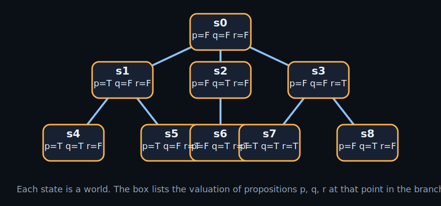

# go-ctl2

`go-ctl2` is effectively a Kripke philosophy calculator.

It uses a small Lisp-based IR to describe actor behavior, state machines, messages, and temporal requirements. The point is not just to generate models. The point is to argue with an LLM over requirements that can actually be checked.

Workflow:

1. the LLM writes a Lisp model
2. the compiler turns it into an explicit transition system
3. you inspect the states, diagrams, and CTL claims
4. you reject or refine the model until the requirements are precise enough to check

Start with [docs/build/ir.generated.md](docs/build/ir.generated.md).
