% Actor IR, CTL, and Diagram Strategy
% go-ctl2
% 2026-03-22

# Goal

This document records the current design intent for the actor IR, the declared control graph, the CTL checking model, the metric/event pipeline, and the documentation build. The target user is someone who can inspect diagrams and predicates, but does not want to learn a large formal language before getting value.

The central idea is:

- an LLM emits actor-role definitions and explicit actor declarations in Lisp
- the Lisp compiles into a small actor/message IR
- the same input drives:
  - runtime execution
  - CTL checking
  - Mermaid generation
  - rendered Markdown diagrams
  - event logs and plots

The design goal is not to infer hidden control flow from simulation alone. Instead, transitions expose control flow through explicit `become` calls, and the compiler walks those action trees to recover possible successor control states.

# Audience

This repository is for readers who want the benefits of temporal logic and executable models without first committing to a large bespoke specification language.

The intended workflow is:

1. describe a requirement in actor/message terms
2. let an LLM draft the Lisp model
3. inspect the generated control states, transitions, predicates, and diagrams
4. run execution, exploration, and CTL checks on the same artifact

The important constraint is inspectability. The user should be able to reject a bad model by reading the states, guards, transitions, predicates, and generated diagrams.

# Design Principles

- explicit control states instead of implicit graph inference
- actor-local ownership of mutable state
- communication as a readiness condition, not as hidden side effect
- one semantic source feeding execution, proof, plots, and diagrams
- a small enough core language that the generated output is reviewable line by line

# Authoring Prompt And Language Reference

The exact information an LLM needs to author models is also the information a human reviewer needs. The documentation therefore includes the literal authoring prompt plus a generated reference for every core form, guard, action, value helper, and branching-time logic form:

# LLM Authoring Prompt

```text
Write a go-ctl2 model as Lisp.
Use exactly one top-level (model ...).
Declare reusable behavior with (actor RoleName ...).
Declare runtime actors explicitly with (instance Name Role (PeerRole Target...)...).
There is no implicit actor creation.
Every send target is written as a peer role in the actor definition and must resolve through the instance bindings.
Use (send Role msg) only when that role resolves to exactly one concrete actor.
Use (send-any Role msg) when a role may resolve to several concrete actors.
State is actor-local. The only cross-actor effect is messaging.
Each transition is (edge guard action...) inside a declared (state ...).
Every edge must eventually reach at least one (become State).
Use (recv var) to consume a message. recv also writes the sender name into local variable sender.
Use quoted literals for structured messages, for example '(message (type ping)).
Keep control flow explicit with named states and become transitions.
Put CTL requirements in (assert ...).
Use only the builtins and forms documented below.
```

# Language Reference

## Core Model Forms

| Form | Parameters | Operational Semantics |
| --- | --- | --- |
| `(model item...)` | `item := actor | instance | assert | xyplot` | Top-level container. No actors are created implicitly. |
| `(actor RoleName item...)` | `item := data | state` | Declares a reusable actor-role template. |
| `(data key value)` | `key` symbol, `value` literal/value form | Introduces actor-local data with an initial value. |
| `(state Name edge...)` | `Name` symbol | Declares a named control state. The first declared state is the initial control location. |
| `(edge guard action...)` | `guard` guard form | Declares one guarded atomic transition. At least one reachable `become` is required. |
| `(instance Name Role (PeerRole Target...)...)` | `Target...` concrete actor names | Creates one runtime actor and binds each referenced peer role to one or more concrete instances. |
| `(assert ctl-formula)` | CTL formula | Adds a branching-time requirement checked over the explored model. |
| `(xyplot name (title s) (steps n) (metric m))` | `metric := send-count | receive-count | sent-minus-received` | Requests a runtime-derived plot for the model example. |

## Guard Forms

| Form | Parameters | Operational Semantics |
| --- | --- | --- |
| `true` | none | Always enabled. |
| `(mailbox msg)` | `msg` message literal/value | True when the actor mailbox currently contains a matching message. |
| `(data= key value)` | `key` local variable, `value` literal/value form | True when the actor-local value equals the resolved right-hand side. |
| `(data> key value)` | numeric comparison | True when the actor-local numeric value is greater than the resolved right-hand side. |
| `(dice-range lo hi)` | floating-point bounds | True when the sampled `Dice` value satisfies `lo ≤ Dice < hi`. |
| `(dice< x)` | floating-point threshold | True when `Dice < x`. |
| `(dice>= x)` | floating-point threshold | True when `Dice ≥ x`. |
| `(dice)` | none | Resolves to the sampled floating-point value in `[0,1]`. |
| `(and g...)`, `(or g...)`, `(not g)`, `(implies p q)` | guard forms | Boolean composition over guard predicates. |

## Action Forms

| Form | Parameters | Operational Semantics |
| --- | --- | --- |
| `(send Role msg)` | `Role` peer role with exactly one bound target | Sends `msg` to the single bound instance. Compile-time error if the role resolves to multiple instances. |
| `(send-any Role msg)` | `Role` peer role with one or more bound targets | Sends to the first ready concrete target in that role set. |
| `(recv var)` | `var` local name | Consumes one incoming message into `var` and also writes the sending actor name into local `sender`. |
| `(become State)` | `State` declared control state | Moves the actor into the next control location. |
| `(set key value)` | local name and value form | Stores the resolved value into actor-local data. |
| `(add key delta)`, `(sub key delta)` | numeric local name and numeric value form | Applies integer arithmetic to actor-local data. |
| `(if guard then [else])` | guard and action blocks | Conditional action execution inside an atomic transition. |
| `(do action...)` | action list | Explicit sequencing when a nested action block is needed. |
| `(def name (p...) body)` | actor-local pure helper | Defines a value-level helper callable from `set`, `send`, and other value positions. |
| `(md5 out source)` | destination variable and value form | Computes the MD5 digest of the resolved value and stores its hex string. |
| `(rsa-raw out modulus exponent message)` | numeric value forms | Computes raw modular exponentiation `message^exponent mod modulus` and stores the numeric result. |
| `(cryptorandom out bytes)` | destination variable and byte count | Generates cryptographic randomness and stores a hex string. |
| `(sample-exponential out rate)` | destination variable and positive rate | Samples an exponential variate and stores the floating-point value. |

## Value Forms

| Form | Parameters | Operational Semantics |
| --- | --- | --- |
| symbols | local variable names | Resolve to actor-local data when present; otherwise remain symbols. |
| `'x`, `'(a b)` | quoted literal | Prevents evaluation and injects a literal symbol/list value. |
| `(cons a b)` | value forms | Prepends `a` onto list `b`. |
| `(car xs)` | list value form | Returns the first list element, or invalid/empty when absent. |
| `(cdr xs)` | list value form | Returns the tail of a list. |

## Branching-Time Logic Forms

### CTL Surface Forms

| Form | Parameters | Operational Semantics |
| --- | --- | --- |
| `(in-state A s)` | actor and state | Atomic predicate `A.state = s`. |
| `(data= A key value)` | actor, local name, value | Atomic predicate over actor-local data. |
| `(mailbox-has A msg)` | actor and message | Atomic predicate over queued messages. |
| `(ex p)`, `(ax p)` | CTL formula | Next-step possibility and necessity. |
| `(ef p)`, `(af p)` | CTL formula | Future possibility and inevitability. |
| `(eg p)`, `(ag p)` | CTL formula | Existential and universal invariance. |
| `(eu p q)`, `(au p q)` | CTL formulas | Existential and universal until. |
| `(not p)`, `(and p q)`, `(or p q)`, `(implies p q)` | CTL formulas | Boolean composition over CTL formulas. |

### Raw Modal μ-Calculus Forms

| Form | Parameters | Operational Semantics |
| --- | --- | --- |
| `true`, `false` | none | Boolean constants for the raw modal μ-calculus layer. |
| `(diamond p)`, `(box p)` | μ-calculus formula | Existential and universal next-step modalities. |
| `(mu X body)`, `(nu X body)` | fixpoint variable and body | Least and greatest fixpoints. |
| `(not p)`, `(and p q)`, `(or p q)` | μ-calculus formulas | Boolean composition over formulas. |
| `(in-state A s)`, `(data= A key value)`, `(mailbox-has A msg)` | same atoms as CTL | State predicates shared with the CTL surface syntax. |


# Terminology

The document uses the following terms consistently:

- actor
  a runtime instance bound to a name and one actor-role definition
- actor role
  a reusable behavior template declared by `(actor RoleName ...)`
- peer role fill
  an instance-level mapping from a referenced role to one or more concrete instances that play it
- state
  a named control location declared directly inside an actor role
- transition
  a guarded atomic step whose successor states are derived from `become`
- mailbox
  the actor-local queue or rendezvous endpoint through which messages arrive
- runtime
  the current collection of actors, local data, mailboxes, and scheduler context
- explored model
  the graph artifact produced by running the runtime semantics over reachable states
- CTL formula
  a temporal requirement evaluated over the induced transition system

# Core Model

## Actor

An actor role has:

- one mailbox
- one current named control state
- local data
- a set of named states

Each runtime actor is created explicitly with `(instance ActorName RoleName (PeerRole InstanceName...)...)`.
Each actor owns its own state. Messages do not mutate the actor directly; they accumulate in the mailbox until the actor reaches a receive-ready transition.

## State

A state is a named control location. For compiled models, the control location is explicit, not inferred from guard overlap.

A state contains transitions. A transition is selectable only if:

- the actor is currently in the state
- the transition guard holds
- all communication in the atomic block is ready

## Transition

A transition contains:

- a guard
- an atomic action block

Example:

```lisp
(edge true
  (recv msg)
  (become got-ping))
```

The compiler walks the action block, collects reachable `become` targets, and uses that successor set for graph construction and CTL. Runtime execution validates that the post-step control state is one of those derived successor states.

An `edge` must contain at least one `become`. Omitting `become` is a compile error; the language does not use implicit self-loops.

The compiler also walks the action block for communication operations.
If `send` or `recv` appear later in the body, the compiler inserts internal wait substates such as `wait__0`, `wait__1`, and rewrites the edge into a chain of explicit control states where each communication step appears at the front of its compiled substate.
That keeps the user-facing source compact while still giving the runtime and the proof layer a clean explicit control graph.

## Why Derived Next States Matter

The central compromise in this repository is that transitions still expose successor control states structurally through `become`, rather than leaving control flow hidden in simulation traces.

That buys several things immediately:

- CTL has a clear successor relation
- control-state diagrams can be rendered without simulation
- sequence and communication diagrams can be generated from the same declared model
- runtime execution can detect mismatches when an actual step lands outside the derived set

It does not remove the need for correct modeling. A wrong `become` structure can still make the proof layer wrong. The point is that the control-flow obligation remains visible and reviewable.

# Scheduling Semantics

The scheduler is single-threaded but concurrent in effect. At each step:

1. choose an actor
2. roll a floating-point `Dice` value in `[0,1]`
3. find the current control state
4. consider transitions in order
5. select the first transition that is fully ready
6. execute it atomically

If the chosen actor has no ready transition, it yields. This is not deadlock. Deadlock means no actor in the whole runtime has any ready transition.

# Communication Semantics

## Buffered Channels

Each actor mailbox can be treated as a bounded or unbounded queue.

- `recv` is ready if a matching message is present
- `send` is ready if the target mailbox has space
- `send-any` is ready if any filled target mailbox has space

## Zero-Capacity Channels

A mailbox capacity of `0` means synchronous rendezvous semantics.

- `send` is ready only if the receiver has a matching ready `recv`
- `send-any` is ready only if at least one filled receiver has a matching ready `recv`
- `recv` is ready only if a sender is ready to rendezvous

The runtime currently models this by checking receiver readiness before a zero-capacity send is allowed to execute.

On a successful `recv`, the payload is stored in the declared variable and the local variable `sender` is also set to the sending actor name. That gives the receiver a built-in return address.

## Random Guards

Before attempting a step, the runtime samples a floating-point value called `Dice` in `[0,1]`.

That value can be used in guards to express random branching, for example:

```lisp
(edge (dice-range 0.0 0.5 "route to branch a")
  (become a))

(edge (dice-range 0.5 1.0 "route to branch b")
  (become b))
```

This is enough to express:

- purely random branching
- Markov-chain style behavior
- mixed control + random behavior where some decisions are scheduled and others are probabilistic

Full M/M/1/5-style example:

```lisp
(model
  (actor ClientRole
    (state loop
      (edge (dice-range 0.0 0.5)
        (set last "sleep")
        (become loop))
      (edge (dice-range 0.5 1.0)
        (send QueueRole req)
        (set last "arrival")
        (become loop))))

  (actor QueueRole
    (state wait
      (edge (and (mailbox req) (data= count 0))
        (recv msg)
        (add count 1)
        (set elapsed 0)
        (become wait))
      (edge (and (mailbox req) (data> count 0) (not (data= count 5)))
        (recv msg)
        (add count 1)
        (become wait))
      (edge (and (mailbox req) (data= count 5))
        (recv dropped)
        (add dropped_count 1)
        (become wait))
      (edge (and (data> count 0) (dice-range 0.0 0.5))
        (sub count 1)
        (set last_departure "service-complete")
        (become wait))
      (edge (and (data> count 0) (dice-range 0.5 1.0))
        (set last_departure "busy")
        (become wait))))

  (instance Client ClientRole (QueueRole Queue))
  (instance Queue QueueRole)

  (xyplot outstanding
    (title "Outstanding Messages By Step")
    (steps 100)
    (metric sent-minus-received)))
```

Interpretation:

- `Client` models arrivals
  `dice-range` makes the sleep/arrival split explicit
- `Queue` models a single-server queue with capacity `5`
  `count` is the current system size and `dropped_count` records blocked arrivals
- departures are the random side
  when `count > 0`, `dice-range` decides whether service completes on that step
- arrivals are client-driven and probabilistic
  scheduler choice still decides when the client gets to act
- the `count = 5` branch is the finite-capacity part
  arrivals are consumed and recorded as drops instead of increasing the queue
- the self-loops are written explicitly with `become`
  the example does not rely on implicit stay-in-place behavior
- the `xyplot` declaration says which runtime-derived chart should be rendered for this model

This is not a continuous-time simulator. It is a small executable control model that captures the same queueing shape:

- probabilistic client arrivals
- one server
- finite capacity `5`
- blocked arrivals counted as losses
- random service completions

That is usually enough for inspectable CTL properties such as:

- eventually the queue becomes non-empty
- the queue can reach saturation
- some executions accumulate drops
- if arrivals stop, the system can drain

Representative predicates for this queue model:

- `(ef (data> Queue count 0) "eventually the queue can become non-empty")`
- `(ef (data= Queue count 5) "the finite-capacity queue can saturate")`
- `(ef (data> Queue dropped_count 0) "some execution can observe blocked arrivals")`
- `(ag (implies (data= Queue count 0) (not (data> Queue dropped_count 0))) "drops only occur after the system has filled at some earlier point")`

The Mermaid artifacts below are a useful companion view for this example:

- a queue state rendition showing explicit self-loops
- a queue message/service rendition showing arrival and service-completion flows

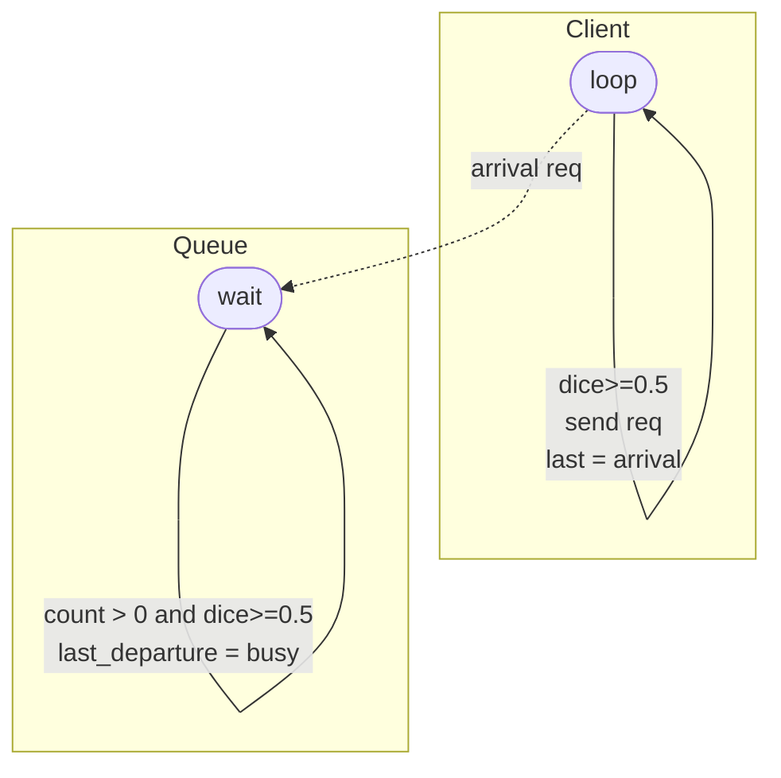

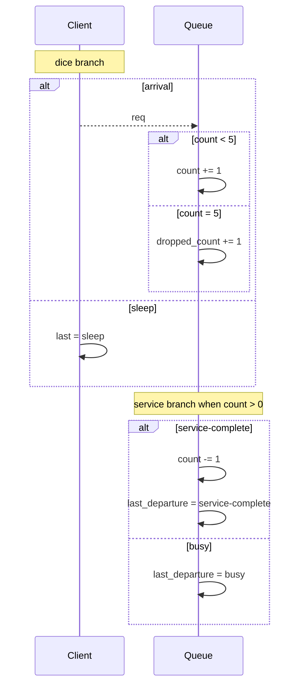

## Decision Processes

When the only source of branching is `Dice`, the operational picture is close to a Markov-chain style model.

When both of these are present:

- scheduler choice over which actor gets the next turn
- `Dice`-driven branching inside actor guards

the operational picture is closer to a decision process: some choices are external or controlled, and some are probabilistic.

That is the important mixed case for systems such as:

- clients competing for service while service outcomes are random
- retry logic with random backoff
- deterministic protocol logic interacting with lossy or probabilistic environments

The current unit tests include both:

- pure random branching through `dice-range`
- a mixed deterministic/probabilistic scenario where a client deterministically sends a request and the server randomly accepts or rejects after receipt

# Atomic Blocks

Communication is part of transition readiness. There is no partial transition semantics.

That means:

- if a `recv` is not ready, the transition is not enabled
- if a `send` is not ready, the transition is not enabled
- no local updates before blocked communication are committed

This makes an atomic transition a real scheduler unit.

The compiler normalizes communication-heavy bodies into explicit wait substates.

At the source level, the user can write local work and communication in one edge body.
At the compiled level, the actor is split so that each `send` or `recv` sits at the front of a generated substate transition, with explicit `become` hops connecting the pieces.

Conceptually, something like this:

```lisp
(edge true
  (set before 1)
  (send B ping)
  (set after 1)
  (become done))
```

becomes an internal shape more like:

```lisp
(edge true
  (set before 1)
  (become start__wait))

(state start__wait
  (edge true
    (send B ping)
    (set after 1)
    (become done)))
```

That removes a lot of source-language noise while preserving explicit compiled control flow.

## What Counts As A State Change

This repository treats a transition firing as a state change even when the actor remains in the same named control state. In other words:

- changing a local variable is a state change
- consuming or sending a message is a state change
- staying in the same named state after the step does not mean “nothing happened”

The graph used by execution and model checking is therefore over full runtime states, while the derived control graph remains the human-facing skeleton.

# Control Flow

The intended structured control tools are:

- tail recursion through `become`
- boolean conditionals through `if`
- loops represented by explicit control states and self-recursive `become`

This is closer to a small structured machine IR than to an arbitrary scripting language.

# Branching-Time Logic

CTL needs an exact successor relation. In this design, the successor relation is derived from `become` calls in each transition body.

Runtime execution exists to validate that:

- transitions only land in derived successor states
- control state updates are not inconsistent with the model

This means CTL does not need to wait for simulation to discover the control graph.

## CTL And μ-Calculus

CTL is Computation Tree Logic, and the implementation lowers it into the modal μ-calculus.

The explored graph is a transition system with runtime states `S` and successor relation `→ ⊆ S × S`. We write `s ⊨ φ` when state `s` satisfies formula `φ`.

The mathematical reading is:

- `EX p` means `∃t. s → t ∧ t ⊨ p`
- `AX p` means `∀t. s → t ⇒ t ⊨ p`
- `EF p` means `μX.(p ∨ ◇X)`
- `AF p` means `μX.(p ∨ □X)`
- `EG p` means `νX.(p ∧ ◇X)`
- `AG p` means `νX.(p ∧ □X)`
- `E[p U q]` means `μX.(q ∨ (p ∧ ◇X))`
- `A[p U q]` means `μX.(q ∨ (p ∧ □X))`

So the user-facing CTL layer and the underlying μ-calculus layer are two views of the same branching-time semantics.

The important idea is that execution does not produce one future. It produces a tree of possible futures:

- scheduler choice can produce different next steps
- random guards can produce different next steps
- mailbox contents can enable or disable different edges

CTL lets us ask whether a property holds on some future branch or on all future branches.

There are two dimensions in every temporal CTL operator:

- path quantifier:
  `E` means "there exists a path"
  `A` means "for all paths"
- time modality:
  `X` means "in the next step"
  `F` means "eventually in the future"
  `G` means "globally, always in the future"
  `U` means "until"

That is the core connection:

- `E` corresponds to existential choice
  some reachable branch works
- `A` corresponds to universal choice
  every reachable branch must work

In ordinary language:

- `EF p`
  there exists some execution path on which `p` eventually becomes true
  "possibly, at some point, `p` happens"
- `AF p`
  on every execution path, `p` eventually becomes true
  "necessarily, sooner or later, `p` happens"
- `EG p`
  there exists some execution path on which `p` remains true forever
  "possibly, the system can stay in a `p`-good region forever"
- `AG p`
  on every execution path, `p` remains true forever
  "necessarily, `p` is always preserved"
- `EX p`
  there exists an immediate successor state where `p` holds
  "possibly on the next step"
- `AX p`
  for every immediate successor state, `p` holds
  "necessarily on the next step"
- `E[p U q]`
  there exists a path where `p` keeps holding until `q` eventually holds
- `A[p U q]`
  on every path, `p` keeps holding until `q` eventually holds

This is why the pairs matter:

- `EF` vs `AF`
  possible eventuality vs guaranteed eventuality
- `EG` vs `AG`
  possible invariant along some branch vs invariant along all branches
- `EX` vs `AX`
  one-step possibility vs one-step necessity
- `EU` vs `AU`
  possible progress condition vs guaranteed progress condition

Examples:

- `(ef (in-state Server accepted))`
  there is some way for the server to reach `accepted`
- `(af (in-state Server accepted))`
  every possible future must eventually reach `accepted`
- `(ag (not (mailbox-has Relay ping)))`
  along all futures, the relay mailbox is always free of `ping`
- `(eg (data> Queue count 0))`
  there exists some path where the queue can stay non-empty forever

`EF` is often the right operator for reachability or possibility.
`AF` is stronger: it means no matter how scheduling and randomness resolve, the desired state is unavoidable.
That difference is exactly why users need the quantifier explanation up front.

## Raw μ-Calculus

The modal mu-calculus is the lower-level fixpoint logic underneath this checker.
CTL is now treated as a readable special case of that more general logic.

At first glance, the implementation of `mu` and `nu` can look almost suspiciously small.
That is because the power comes from the combination of just three ideas:

- boolean structure
- modal next-step structure
- fixpoints over a finite successor graph

The modal operators are:

- `diamond p`
  there exists a successor state where `p` holds
  this is the same branching idea as CTL's existential next-step operator
- `box p`
  for all successor states, `p` holds
  this is the universal next-step version

The fixpoint operators are:

- `mu X body`
  least fixpoint
  think "the smallest set of states that satisfies this recursive equation"
- `nu X body`
  greatest fixpoint
  think "the largest set of states that satisfies this recursive equation"

Intuition:

- `mu` is usually how you express eventuality, progress, or finite escape
- `nu` is usually how you express invariance, persistence, or the ability to remain inside a region forever

That is the core mental model:

- least fixpoint = build upward from nothing
- greatest fixpoint = prune downward from everything

### Small Examples

Reachability:

```lisp
(mu X
  (or (in-state Server accepted)
      (diamond X)))
```

Read it as:

- a state satisfies this formula if
  it is already an `accepted` state
  or it can move in one step to another state that satisfies the same formula

That is exactly "there exists a path that eventually reaches `accepted`".
So this is the mu-calculus form of `EF`.

Invariant preservation:

```lisp
(nu X
  (and (not (mailbox-has Relay ping))
       (box X)))
```

Read it as:

- a state satisfies this formula if
  it is safe now
  and all of its successors also satisfy the same invariant

That is exactly "on all paths, always safe".
So this is the mu-calculus form of `AG`.

Possible persistence:

```lisp
(nu X
  (and (data> Queue count 0)
       (diamond X)))
```

Read it as:

- the queue is non-empty now
- and there exists some next step that keeps you inside the same region

That captures the idea that there is some execution branch along which the queue can remain non-empty forever.
That is the mu-calculus form of `EG`.

### Why The Algorithm Is So Small

The evaluator looks small because it is doing repeated set refinement on a finite graph.

For `mu`:

- start with the empty set
- evaluate the body assuming `X` means that current set
- keep adding states until nothing changes

For `nu`:

- start with the set of all states
- evaluate the body assuming `X` means that current set
- keep removing states until nothing changes

That is enough to express a large amount of temporal reasoning because recursive temporal properties are exactly what fixpoints are good at.

For example:

- "eventually reach a good state"
  means repeated predecessor expansion until the set stabilizes
- "always remain safe"
  means repeated pruning of states that have bad successors until the set stabilizes
- "stay inside this region forever on some branch"
  means repeatedly removing states that cannot remain inside the region

### CTL As A Special Case

The reason this is such a good foundation is that standard CTL operators translate directly into mu-calculus:

- `EX p`
  becomes `(diamond p)`
- `AX p`
  becomes `(box p)`
- `EF p`
  becomes `(mu X (or p (diamond X)))`
- `AF p`
  becomes `(mu X (or p (box X)))`
- `EG p`
  becomes `(nu X (and p (diamond X)))`
- `AG p`
  becomes `(nu X (and p (box X)))`
- `E[p U q]`
  becomes `(mu X (or q (and p (diamond X))))`
- `A[p U q]`
  becomes `(mu X (or q (and p (box X))))`

So CTL is not being replaced here.
It becomes the user-facing fragment with the friendlier names, while the semantic engine underneath is the more general fixpoint logic.

### Why This Feels Like LTL Territory

It is reasonable to look at these formulas and think:
"these are the kinds of things I usually use LTL for".

That instinct is right in a practical sense.
Many properties people ask for in system design sound like:

- eventually something good happens
- always something bad is prevented
- once a request arrives, eventually a response appears
- some loop can continue forever

Those are the same kinds of temporal intuitions that lead people to LTL.

The important distinction is semantic:

- LTL talks about a single path at a time
- CTL and the mu-calculus talk directly about branching futures

In this repository, branching matters a lot:

- scheduler choice creates alternative next steps
- random guards create alternative next steps
- mailbox contents create alternative next steps

So a branching-time logic is a better fit than plain linear-time reasoning.

The nice surprise is that the mu-calculus is expressive enough to capture many of the "eventually", "always", and "until" properties people informally think of as LTL-style requirements, while still speaking directly about the branching graph your runtime actually explores.

### Practical Reading Guide

When reading a raw mu-calculus formula:

1. identify the atomic predicate
   what is the local fact you care about?
2. identify the modal direction
   `diamond` means "some next branch", `box` means "every next branch"
3. identify the fixpoint
   `mu` usually means eventuality or progress
   `nu` usually means invariance or persistence
4. read the recursion as "keep applying this condition until it stabilizes"

That is all the checker is doing in code.
It is simple enough to implement compactly, but general enough to cover a large part of practical temporal reasoning.

## Present Operators

The implementation currently supports:

- `not`, `and`, `or`, `implies`
- `ex`, `ax`
- `ef`, `af`
- `eg`, `ag`
- `eu`, `au`

Raw mu-calculus operators currently include:

- `true`, `false`
- `not`, `and`, `or`
- `diamond`, `box`
- `mu`, `nu`
- atomic predicates such as `in-state`, `data=`, and `mailbox-has`

Atomic predicates currently include:

- `(in-state A done "actor A is in done")`
- `(data= A key value "actor A has the expected value")`
- `(mailbox-has A msg "actor A currently holds the message")`

Predicate forms may carry a final string argument used only as human-readable documentation. The evaluator ignores that trailing string semantically.

## How The Checker Works

The algorithm in this repository is a standard finite-state CTL model-checking pattern over the explored runtime graph.

Step 1: build the reachable graph.

- start from the initial runtime
- execute one enabled actor step at a time
- clone successor runtimes
- deduplicate states by a serialized runtime key
- record the successor relation between runtime states

If a state has no enabled successors, the implementation records a self-loop labeled `deadlock`.
That makes deadlock states explicit in the graph and keeps the temporal operators total.

Step 2: evaluate formulas by computing the set of satisfying states.

For each subformula, the checker computes:

- the set of explored states where the subformula is true

Atomic predicates are evaluated directly on each runtime state.
Boolean operators are evaluated by ordinary set operations:

- `not`
  complement
- `and`
  intersection
- `or`
  union
- `implies`
  `not left or right`

The temporal operators are computed from the successor graph:

- `EX p`
  mark any state with at least one successor already marked by `p`
- `AX p`
  mark any state whose successors are all marked by `p`
- `EF p`
  reduce to `E[true U p]`
- `AF p`
  reduce to `A[true U p]`
- `AG p`
  reduce to `not EF not p`
- `EG p`
  compute a greatest fixpoint:
  start from states satisfying `p`, then repeatedly remove any state that cannot stay inside that set on at least one successor
- `EU(p, q)`
  compute a least fixpoint:
  start from states satisfying `q`, then repeatedly add states satisfying `p` that can move to an already accepted state
- `AU(p, q)`
  compute a least fixpoint:
  start from states satisfying `q`, then repeatedly add states satisfying `p` whose successors are all already accepted

So the checker is not proving arbitrary mathematics.
It is doing graph analysis on the explored transition system induced by the actor model.

That is exactly why this works well here:

- the graph is explicit
- the control flow is explicit
- the user can inspect both the model and the formulas
- the result can be explained in ordinary "possibly/necessarily, eventually/always" language

## What CTL Is Proving Here

At the current stage, CTL is proving properties over the repository’s induced model, not solving theorem-proving problems over arbitrary infinite mathematics.

That means:

- if the reachable state space is finite and fully explored, the model-checking result is exact for that model
- if the model is bounded or abstracted, the result applies to that abstraction
- if the derived `become` successor relation is wrong, the result is only as good as that model

This is still useful. The tool is intended to make control flow, messaging, and temporal requirements inspectable enough that a human can review the generated model rather than trusting a hidden formalization.

# Event Log And Metrics

Transitions, sends, and receives are recorded as structured runtime events. This is the base layer for line graphs and performance-style metrics.

At the current stage, the runtime can already derive:

- cumulative event counts
- filtered counts, for example “sends only to Server”
- simple rate series over scheduler steps

This is the beginning of the metrics side of the tool. The goal is that message rates, queue growth, latency, throughput, and retry behavior should come from the event log rather than from ad hoc parsing of trace strings.

# Built-ins

The canonical builtin inventory now lives in the generated authoring reference near the top of this document so the human-facing documentation and the LLM-facing prompt share one source of truth.

# Why This IR Is Sensible

The IR is sensible if the following remain true:

- one mailbox per actor
- explicit named control states
- explicit transition names
- successor states derived from `become`
- actor-local state is only mutated by the actor itself
- communication readiness gates transition selection
- CTL consumes the same declared control graph that diagrams do
- event plots are derived from the same runtime semantics

This gives a coherent story for:

- execution
- proof
- metric plots
- diagram generation
- LLM-assisted authoring

## Relation To Other Formalisms

This project is not trying to replicate TLA+, CSP, PRISM, or Erlang exactly.

Instead, it borrows selected strengths:

- from actor systems:
  mailbox ownership and explicit message passing
- from Erlang:
  receive-driven control and guarded mailbox inspection
- from ASM thinking:
  explicit state updates and executable semantic steps
- from FSM/CFG thinking:
  named control locations and declared successor structure
- from model checking:
  CTL over a precise transition relation

The value is in the combination: a readable actor/message IR that an LLM can draft and a human can still audit.

# Reverse Mermaid Direction

The intended future workflow is:

1. LLM emits actor Lisp
2. the tool serializes the runtime/model as Lisp
3. a single Mermaid generator reads that Lisp
4. the generated Markdown embeds Mermaid directly
5. GitHub or the local HTML renderer turns that Mermaid into diagrams

This allows:

- state machine diagrams without simulation
- sequence diagrams without simulation
- UML-like class diagrams showing actor-local control states and data
- the same input feeding both proof and presentation

# Repository Layout

The current repository is intentionally small. The most important files are:

- `main.go`
  the reader, runtime, CTL implementation, event log, and serialization code
- `main_test.go`
  executable examples that pin down the semantics
- `docs/ir.md`
  this document
- `docs/mermaid/`
  optional local Mermaid sources for preview diagrams
- `docs/generated/`
  ignored local build intermediates
- `scripts/`
  helper scripts used by the documentation pipeline

The tests are not secondary. They are the clearest executable specification currently in the repository.

# Worked Examples

The canonical examples are generated as exact input/output pairs: the literal Lisp source first, then the literal Markdown emitted from that same source. That keeps the diagrams, CTL outcomes, and plot references adjacent to the example instead of scattering them across later sections.

## Message Chain Example

### Input Lisp

```lisp
(model
		(actor ClientRole
			(state start
				(edge true
					(send RelayRole '(message (type ping)))
					(become done)))
			(state done))

		(actor RelayRole
			(state relay
				(edge true
					(recv msg)
					(send ServerRole msg)
					(become done)))
			(state done))

		(actor ServerRole
			(state idle
				(edge true
					(recv received)
					(become done)))
			(state done))

		(instance Client ClientRole (RelayRole Relay))
		(instance Relay RelayRole (ServerRole Server))
		(instance Server ServerRole)

		(assert (ef (data= Server received '(message (type ping)))))
		(assert (af (data= Server received '(message (type ping)))))

		(xyplot message_outstanding
			(title "Message Chain Outstanding Messages")
			(steps 4)
			(metric sent-minus-received))
		(xyplot message_sends
			(title "Message Chain Sends By Step")
			(steps 4)
			(metric send-count))
		(xyplot message_receives
			(title "Message Chain Receives By Step")
			(steps 4)
			(metric receive-count)))
```

### Rendered Output

#### State Diagram

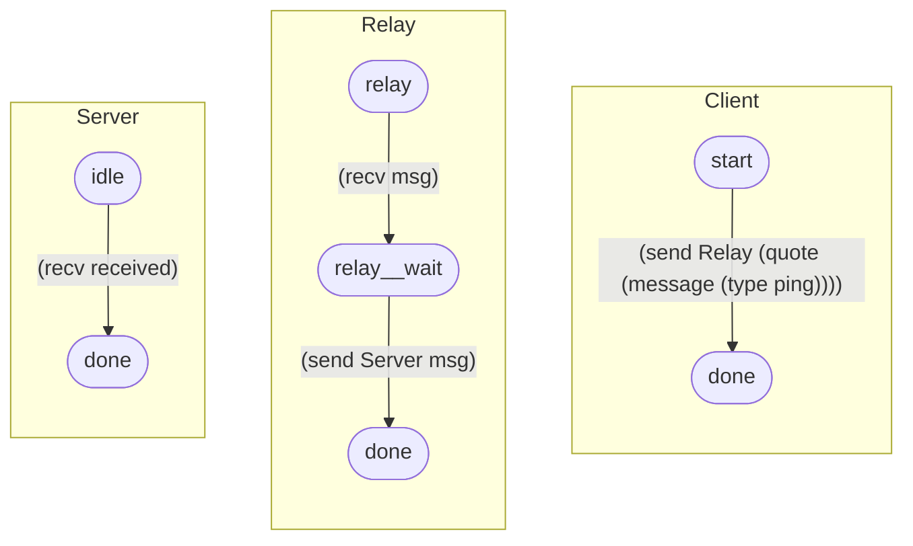

#### Message Diagram

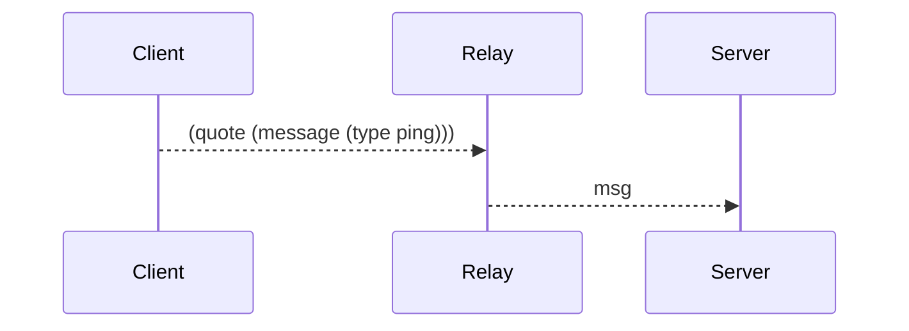

#### Class Diagram

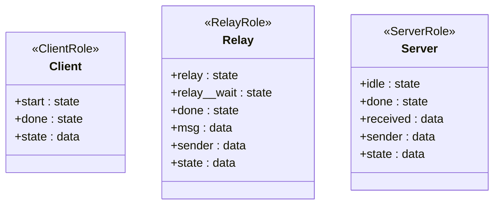

#### CTL Outcomes

- `PASS` `(ef (data= Server received (quote (message (type ping)))))`
- `PASS` `(af (data= Server received (quote (message (type ping)))))`

#### Line Graphs

##### Message Chain Outstanding Messages

```lisp
(xyplot message_outstanding (title "Message Chain Outstanding Messages") (steps 4) (metric sent-minus-received))
```

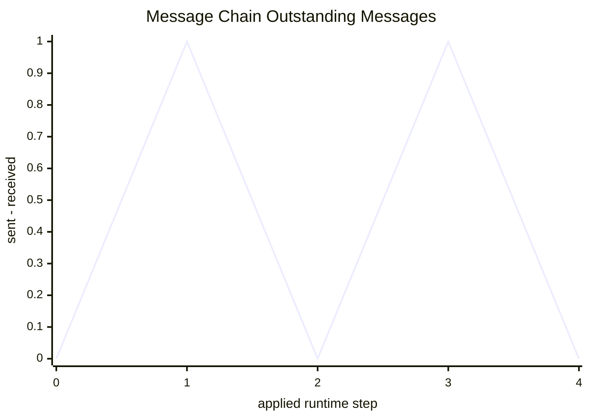

##### Message Chain Sends By Step

```lisp
(xyplot message_sends (title "Message Chain Sends By Step") (steps 4) (metric send-count))
```

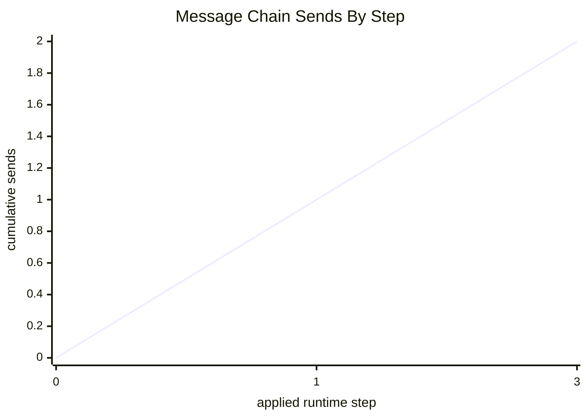

##### Message Chain Receives By Step

```lisp
(xyplot message_receives (title "Message Chain Receives By Step") (steps 4) (metric receive-count))
```

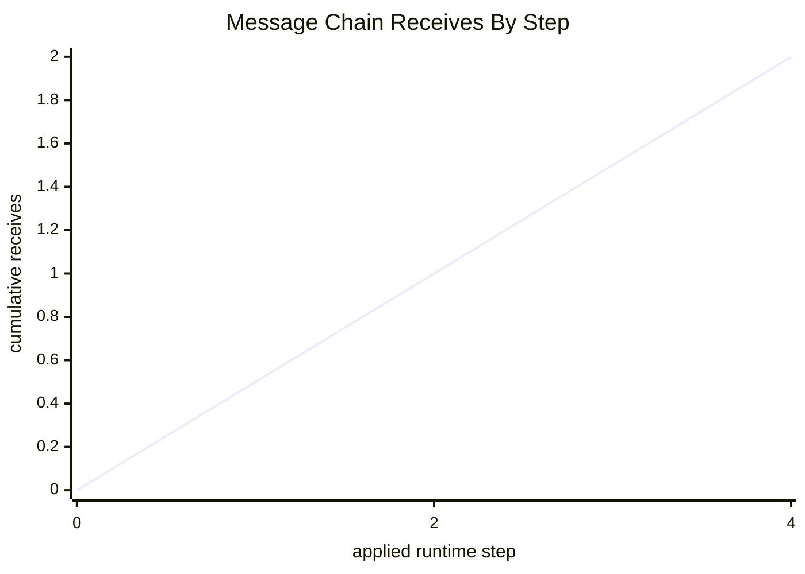

## Queue Example

### Input Lisp

```lisp
(model
		(actor ClientRole
			(state loop
				(edge (dice-range 0.0 0.5)
					(set last "sleep")
					(become loop))
				(edge (dice-range 0.5 1.0)
					(send QueueRole req)
					(set last "arrival")
					(become loop))))

		(actor QueueRole
			(state wait
				(edge (and (mailbox req) (data= count 0))
					(recv msg)
					(add count 1)
					(set elapsed 0)
					(become wait))
				(edge (and (mailbox req) (data> count 0) (not (data= count 5)))
					(recv msg)
					(add count 1)
					(become wait))
				(edge (and (mailbox req) (data= count 5))
					(recv dropped)
					(add dropped_count 1)
					(become wait))
				(edge (and (data> count 0) (dice-range 0.0 0.5))
					(sub count 1)
					(set last_departure "service-complete")
					(become wait))
				(edge (and (data> count 0) (dice-range 0.5 1.0))
					(set last_departure "busy")
					(become wait))))

		(instance Client ClientRole (QueueRole Queue))
		(instance Queue QueueRole)

		(xyplot queue_outstanding
			(title "Outstanding Messages By Step")
			(steps 100)
			(metric sent-minus-received)))
```

### Rendered Output

#### State Diagram


#### Message Diagram

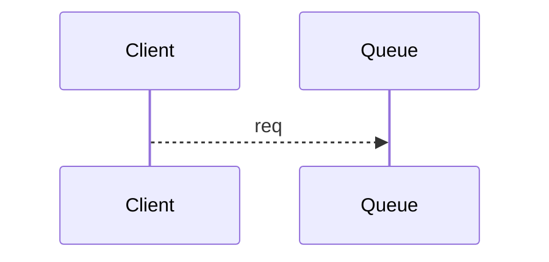

#### Class Diagram

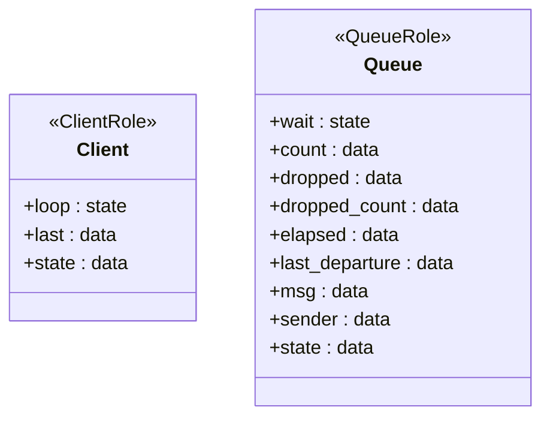

#### Line Graphs

##### Outstanding Messages By Step

```lisp
(xyplot queue_outstanding (title "Outstanding Messages By Step") (steps 100) (metric sent-minus-received))
```

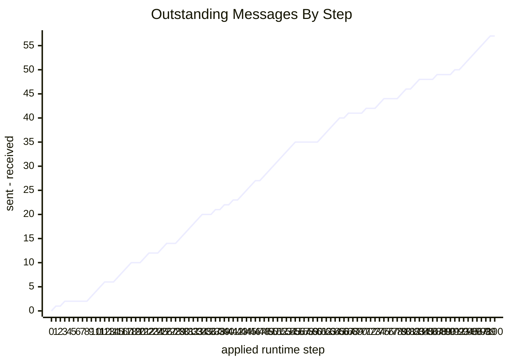

## Bakery Role-Reuse Example

### Input Lisp

```lisp
(model
		(actor ProductionRole
			(data baked 0)
			(state start
				(edge true
					(send-any TruckRole batch)
					(add baked 1)
					(become done)))
			(state done))

		(actor TruckRole
			(data deliveries 0)
			(state wait
				(edge true
					(recv cargo)
					(add deliveries 1)
					(send StoreRole cargo)
					(become done)))
			(state done))

		(actor StoreRole
			(data inventory 0)
			(data sold 0)
			(state idle
				(edge true
					(recv shipment)
					(add inventory 1)
					(become stocked)))
			(state stocked
				(edge true
					(send CustomerBaseRole sale)
					(sub inventory 1)
					(add sold 1)
					(become stocked))))

		(actor CustomerBaseRole
			(data served 0)
			(state ready
				(edge true
					(recv sale)
					(add served 1)
					(become ready))))

		(instance Production ProductionRole (TruckRole TruckNorth TruckSouth))
		(instance TruckNorth TruckRole (StoreRole StoreA))
		(instance TruckSouth TruckRole (StoreRole StoreB))
		(instance StoreA StoreRole (CustomerBaseRole CustomerA))
		(instance StoreB StoreRole (CustomerBaseRole CustomerB))
		(instance StoreC StoreRole (CustomerBaseRole CustomerC))
		(instance CustomerA CustomerBaseRole)
		(instance CustomerB CustomerBaseRole)
		(instance CustomerC CustomerBaseRole))
```

### Rendered Output

#### State Diagram


#### Message Diagram

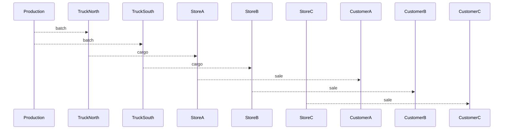

#### Class Diagram

```mermaid
classDiagram
    class Production {
        +start : state
        +done : state
        +baked : data
        +state : data
    }
    <<ProductionRole>> Production
    class TruckNorth {
        +wait : state
        +wait__wait : state
        +done : state
        +cargo : data
        +deliveries : data
        +sender : data
        +state : data
    }
    <<TruckRole>> TruckNorth
    class TruckSouth {
        +wait : state
        +wait__wait : state
        +done : state
        +cargo : data
        +deliveries : data
        +sender : data
        +state : data
    }
    <<TruckRole>> TruckSouth
    class StoreA {
        +idle : state
        +stocked : state
        +inventory : data
        +sender : data
        +shipment : data
        +sold : data
        +state : data
    }
    <<StoreRole>> StoreA
    class StoreB {
        +idle : state
        +stocked : state
        +inventory : data
        +sender : data
        +shipment : data
        +sold : data
        +state : data
    }
    <<StoreRole>> StoreB
    class StoreC {
        +idle : state
        +stocked : state
        +inventory : data
        +sender : data
        +shipment : data
        +sold : data
        +state : data
    }
    <<StoreRole>> StoreC
    class CustomerA {
        +ready : state
        +sale : data
        +sender : data
        +served : data
        +state : data
    }
    <<CustomerBaseRole>> CustomerA
    class CustomerB {
        +ready : state
        +sale : data
        +sender : data
        +served : data
        +state : data
    }
    <<CustomerBaseRole>> CustomerB
    class CustomerC {
        +ready : state
        +sale : data
        +sender : data
        +served : data
        +state : data
    }
    <<CustomerBaseRole>> CustomerC
```


# Message Plot

Because transitions, sends, and receives are now logged as structured events, the docs can render plots from an actual Runtime execution instead of from hand-written points.

One such plot is declared in the model itself with:

```lisp
(xyplot queue_outstanding
  (title "Outstanding Messages By Step")
  (steps 100)
  (metric sent-minus-received))
```

The line charts below are rendered from every `xyplot` declaration in the example models. The queue plot is a 100-step run of the M/M/1/5-style queue example above. It starts at `0`, and the `sent-minus-received` line is positive exactly when sends are ahead of receives. It does not force the run to end at `0`, because this queue model can still have accepted work in service even after mailbox traffic has balanced out.

### Message Outstanding


<details>
<summary>XY Plot Source: <code>message_outstanding</code></summary>
<pre><code class="language-lisp">
(xyplot message_outstanding
  (title "Message Chain Outstanding Messages")
  (steps 4)
  (metric sent-minus-received))
</code></pre>
</details>

### Message Receives


<details>
<summary>XY Plot Source: <code>message_receives</code></summary>
<pre><code class="language-lisp">
(xyplot message_receives
  (title "Message Chain Receives By Step")
  (steps 4)
  (metric receive-count))
</code></pre>
</details>

### Message Sends


<details>
<summary>XY Plot Source: <code>message_sends</code></summary>
<pre><code class="language-lisp">
(xyplot message_sends
  (title "Message Chain Sends By Step")
  (steps 4)
  (metric send-count))
</code></pre>
</details>

### Queue Outstanding

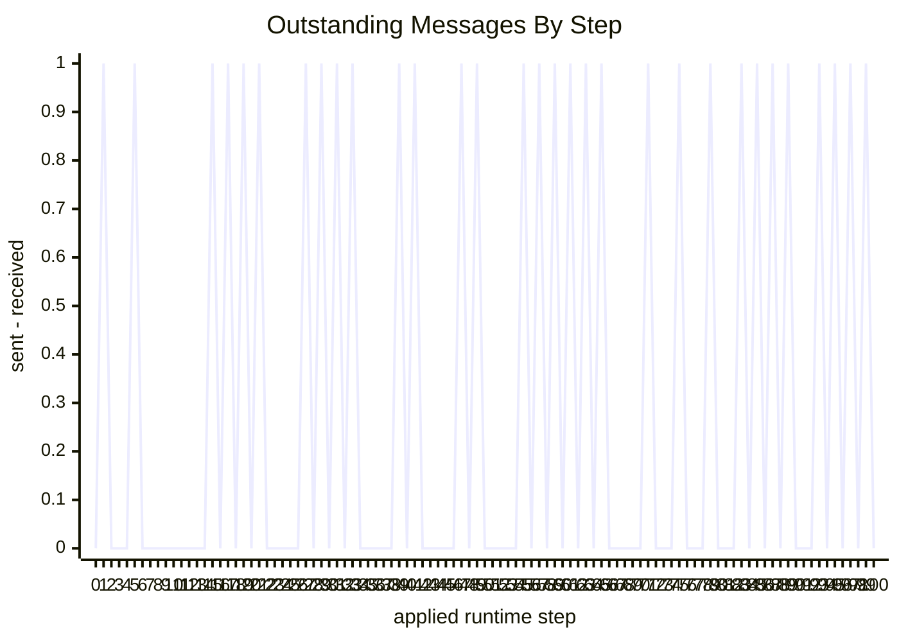

<details>
<summary>XY Plot Source: <code>queue_outstanding</code></summary>
<pre><code class="language-lisp">
(xyplot queue_outstanding
  (title "Outstanding Messages By Step")
  (steps 100)
  (metric sent-minus-received))
</code></pre>
</details>


Natural follow-on plots include:

- sends per step
- receives per step
- moving-average throughput
- queue length by actor
- service latency between matching send and receive events
- timeout and retry counters

# Mermaid Artifacts

The committed Markdown keeps Mermaid inline so GitHub can render the diagrams directly from the source document.

The important constraint is that the diagrams are not decorative extras. They are another view over the same declared control structure, and the examples above keep those diagrams next to the Lisp that generated them.

# Build

The `Makefile` provides:

- `make test`
- `make docs`
- `make diagrams`
- `make serve-docs`
- `make clean`

Current assumptions:

- `pandoc` is installed for document generation
- `mmdc` is optional and only needed for `make diagrams`

The document and Mermaid build are intentionally kept separate so the same generated Mermaid source can be inspected directly.

# Serving The HTML

After running `make docs`, the generated document lives at:

- `docs/build/ir.html`

For local review, the repository also provides a simple static server target:

- `make serve-docs`

That serves `docs/build/` over a local HTTP server so the generated HTML can be reviewed together in a browser.

# Current Limits

This repository is still a skeleton. Important things are intentionally incomplete:

- the example plots are generated from a fixed example, not yet from arbitrary models
- the Mermaid generation is still mostly document-oriented rather than language-integrated
- CTL formulas are present, but there is not yet a full proposition language over every part of runtime state
- the documentation explains the intended semantics more completely than the current implementation exposes through tooling

That is acceptable for this stage. The repository is already good enough to show the core thesis:

- actor/message models can be generated in a compact Lisp
- the same artifact can feed execution, diagrams, CTL checks, and simple metric plots
- the result is inspectable enough to review rather than merely trust
