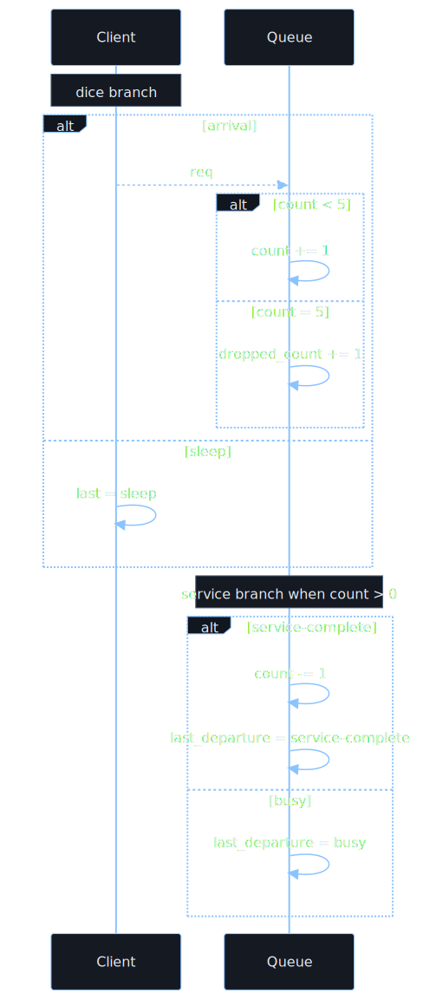

### A To B Sequence

Mermaid Source: <code>a_to_b_sequence.mmd</code>

<pre><code class="language-mermaid">
sequenceDiagram
    participant Client
    participant Relay
    participant Server
    Client--&gt;&gt;Relay: message(type=ping)
    Relay--&gt;&gt;Server: message(type=ping)
</code></pre>

### A To B State

Mermaid Source: <code>a_to_b_state.mmd</code>

<pre><code class="language-mermaid">
flowchart TD
    subgraph Client
        direction TB
        C_loop([loop]) --&gt;|&quot;sent = ping&quot;| C_loop
    end

    subgraph Relay
        direction TB
        subgraph R_relay[&quot;relay&quot;]
            direction TB
            R_wait([wait])
        end
        R_entry(( ))
        R_entry --&gt;|&quot;recv msg&quot;| R_wait
        R_wait --&gt;|&quot;send msg&quot;| R_entry
    end

    subgraph Server
        direction TB
        S_idle([idle]) --&gt;|&quot;received = ping&quot;| S_idle
    end

    C_loop -. send ping .-&gt; R_relay
    R_wait -. send ping .-&gt; S_idle
</code></pre>

### Mm1 5 Queue Flow

Mermaid Source: <code>mm1_5_queue_flow.mmd</code>

<pre><code class="language-mermaid">
sequenceDiagram
    participant Client
    participant Queue
    Note over Client: dice branch
    alt arrival
        Client--&gt;&gt;Queue: req
        alt count &lt; 5
            Queue-&gt;&gt;Queue: count += 1
        else count = 5
            Queue-&gt;&gt;Queue: dropped_count += 1
        end
    else sleep
        Client-&gt;&gt;Client: last = sleep
    end
    Note over Queue: service branch when count &gt; 0
    alt service-complete
        Queue-&gt;&gt;Queue: count -= 1
        Queue-&gt;&gt;Queue: last_departure = service-complete
    else busy
        Queue-&gt;&gt;Queue: last_departure = busy
    end
</code></pre>

### Mm1 5 Queue State

Mermaid Source: <code>mm1_5_queue_state.mmd</code>

<pre><code class="language-mermaid">
flowchart TD
    subgraph Client
        direction TB
        C_loop([loop]) --&gt;|&quot;dice&amp;lt;0.5&lt;br/&gt;last = sleep&quot;| C_loop
        C_loop --&gt;|&quot;dice&amp;gt;=0.5&lt;br/&gt;send req&lt;br/&gt;last = arrival&quot;| C_loop
    end

    subgraph Queue
        direction TB
        Q_wait([wait]) --&gt;|&quot;req and count = 0&lt;br/&gt;count += 1&lt;br/&gt;elapsed = 0&quot;| Q_wait
        Q_wait --&gt;|&quot;req and 0 &amp;lt; count &amp;lt; 5&lt;br/&gt;count += 1&quot;| Q_wait
        Q_wait --&gt;|&quot;req and count = 5&lt;br/&gt;dropped_count += 1&quot;| Q_wait
        Q_wait --&gt;|&quot;count &amp;gt; 0 and dice&amp;lt;0.5&lt;br/&gt;count -= 1&lt;br/&gt;last_departure = service-complete&quot;| Q_wait
        Q_wait --&gt;|&quot;count &amp;gt; 0 and dice&amp;gt;=0.5&lt;br/&gt;last_departure = busy&quot;| Q_wait
    end

    C_loop -. arrival req .-&gt; Q_wait
</code></pre>

