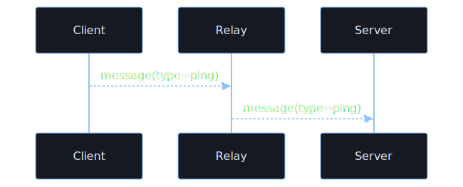

### A To B Sequence

Mermaid Source: <code>a_to_b_sequence.mmd</code>

<pre><code class="language-mermaid">
sequenceDiagram
    participant Client
    participant Relay
    participant Server
    Client--&gt;&gt;Relay: message(type=ping)
    Relay--&gt;&gt;Server: message(type=ping)
</code></pre>

### A To B State

Mermaid Source: <code>a_to_b_state.mmd</code>

<pre><code class="language-mermaid">
flowchart TD
    subgraph Client
        direction TB
        C_start([start]) --&gt;|&quot;sent = ping&lt;br/&gt;become done&quot;| C_done([done])
    end

    subgraph Relay
        direction TB
        R_wait([wait]) --&gt;|&quot;received = ping&lt;br/&gt;forwarded = ping&lt;br/&gt;become forwarded&quot;| R_forwarded([forwarded])
        R_wait --&gt;|&quot;wrong type or no ping&lt;br/&gt;become wait&quot;| R_wait
    end

    subgraph Server
        direction TB
        S_idle([idle]) --&gt;|&quot;received = ping&lt;br/&gt;become accepted&quot;| S_accepted([accepted])
        S_idle --&gt;|&quot;wrong type or no ping&lt;br/&gt;become idle&quot;| S_idle
    end

    C_done -. send ping .-&gt; R_wait
    R_forwarded -. send ping .-&gt; S_idle
</code></pre>

