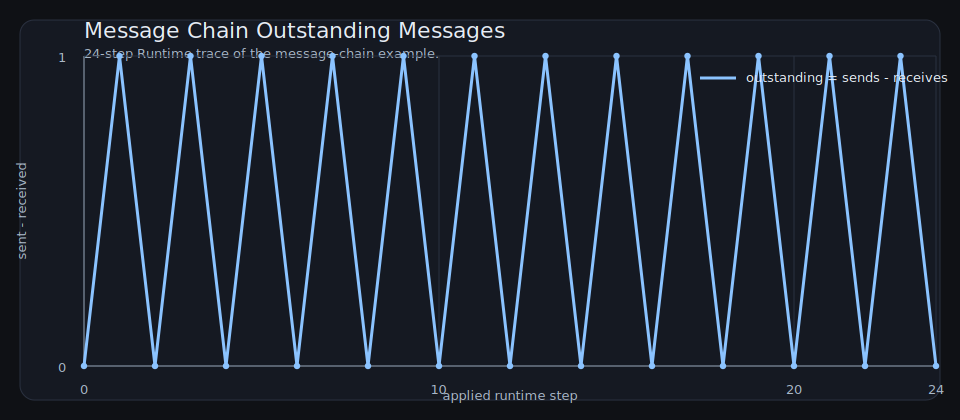
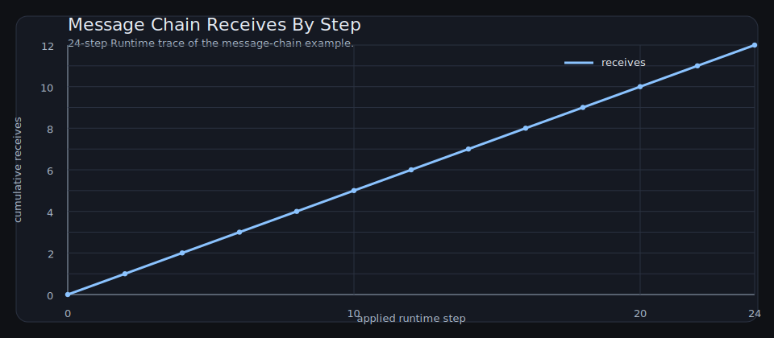
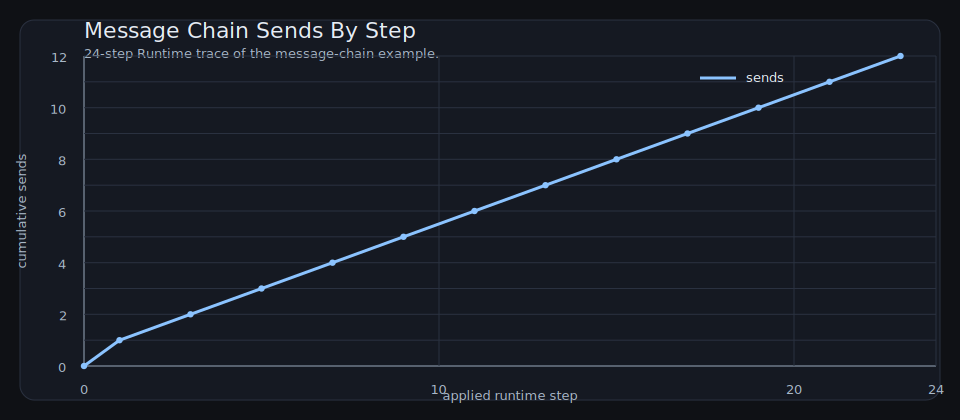
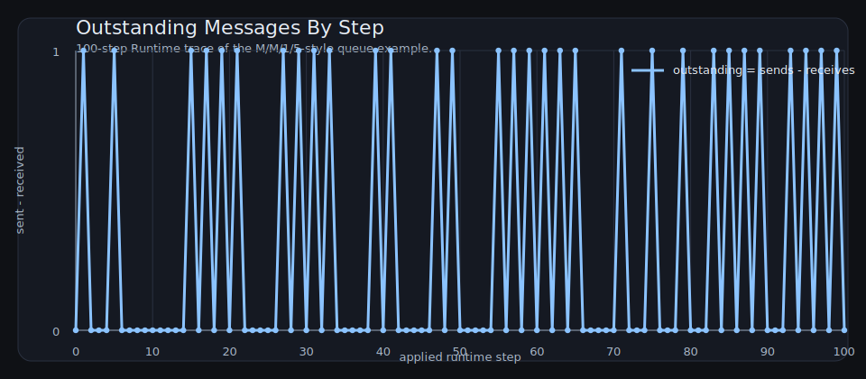

### Message Outstanding

XY Plot Source: <code>message_outstanding</code>

<pre><code class="language-lisp">
(xyplot message_outstanding
  (title &quot;Message Chain Outstanding Messages&quot;)
  (steps 24)
  (metric sent-minus-received))
</code></pre>

### Message Receives

XY Plot Source: <code>message_receives</code>

<pre><code class="language-lisp">
(xyplot message_receives
  (title &quot;Message Chain Receives By Step&quot;)
  (steps 24)
  (metric receive-count))
</code></pre>

### Message Sends

XY Plot Source: <code>message_sends</code>

<pre><code class="language-lisp">
(xyplot message_sends
  (title &quot;Message Chain Sends By Step&quot;)
  (steps 24)
  (metric send-count))
</code></pre>

### Queue Outstanding

XY Plot Source: <code>queue_outstanding</code>

<pre><code class="language-lisp">
(xyplot queue_outstanding
  (title &quot;Outstanding Messages By Step&quot;)
  (steps 100)
  (metric sent-minus-received))
</code></pre>

