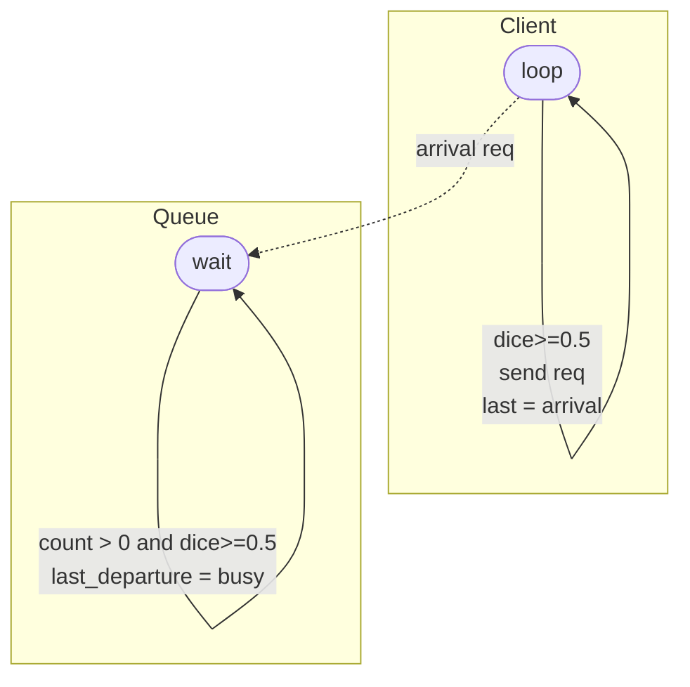
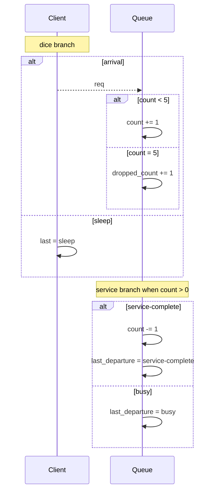

% Actor IR, CTL, and Diagram Strategy
% go-ctl2
% 2026-03-22

# Goal

This document records the current design intent for the actor IR, the declared control graph, the CTL checking model, the metric/event pipeline, and the documentation build. The target user is someone who can inspect diagrams and predicates, but does not want to learn a large formal language before getting value.

The central idea is:

- an LLM emits actor-role definitions and explicit actor declarations in Lisp
- the Lisp compiles into a small actor/message IR
- the same input drives:
  - runtime execution
  - CTL checking
  - Mermaid generation
  - rendered Markdown diagrams
  - event logs and plots

The design goal is not to infer hidden control flow from simulation alone. Instead, transitions expose control flow through explicit `become` calls, and the compiler walks those action trees to recover possible successor control states.

# Audience

This repository is for readers who want the benefits of temporal logic and executable models without first committing to a large bespoke specification language.

The intended workflow is:

1. describe a requirement in actor/message terms
2. let an LLM draft the Lisp model
3. inspect the generated control states, transitions, predicates, and diagrams
4. run execution, exploration, and CTL checks on the same artifact

The important constraint is inspectability. The user should be able to reject a bad model by reading the states, guards, transitions, predicates, and generated diagrams.

# Design Principles

- explicit control states instead of implicit graph inference
- actor-local ownership of mutable state
- communication as a readiness condition, not as hidden side effect
- one semantic source feeding execution, proof, plots, and diagrams
- a small enough core language that the generated output is reviewable line by line

# Authoring Prompt And Language Reference

The exact information an LLM needs to author models is also the information a human reviewer needs. The documentation therefore includes the literal authoring prompt plus a generated reference for every core form, guard, action, value helper, and branching-time logic form:

{{LANGUAGE_SECTIONS}}

# Terminology

The document uses the following terms consistently:

- actor
  a runtime instance bound to a name and one actor-role definition
- actor role
  a reusable behavior template declared by `(actor RoleName ...)`
- peer role fill
  an instance-level mapping from a referenced role to one or more concrete instances that play it
- state
  a named control location declared directly inside an actor role
- transition
  a guarded atomic step whose successor states are derived from `become`
- mailbox
  the actor-local queue or rendezvous endpoint through which messages arrive
- runtime
  the current collection of actors, local data, mailboxes, and scheduler context
- explored model
  the graph artifact produced by running the runtime semantics over reachable states
- CTL formula
  a temporal requirement evaluated over the induced transition system

# Core Model

## Actor

An actor role has:

- one mailbox
- one current named control state
- local data
- a set of named states

Each runtime actor is created explicitly with `(instance ActorName RoleName (queue N) (PeerRole InstanceName...)...)`.
`N` is the mailbox length for that concrete actor.
Each actor owns its own state. Messages do not mutate the actor directly; they accumulate in the mailbox until the actor reaches a receive-ready transition.
The current control location is explicit in actor-local data and changes through `become`; it is not inferred from overlapping state predicates.

## State

A state is a named control location. For compiled models, the control location is explicit, not inferred from guard overlap.

A state contains transitions. A transition is selectable only if:

- the actor is currently in the state
- the transition guard holds
- all communication in the atomic block is ready

## Transition

A transition contains:

- a guard
- an atomic action block

Example:

```lisp
(edge true
  (recv msg)
  (become got-ping))
```

The compiler walks the action block, collects reachable `become` targets, and uses that successor set for graph construction and CTL. Runtime execution validates that the post-step control state is one of those derived successor states.

An `edge` must contain at least one `become`. Omitting `become` is a compile error; the language does not use implicit self-loops.

The compiler also walks the action block for communication operations.
If `send` or `recv` appear later in the body, the compiler inserts internal wait substates such as `wait__0`, `wait__1`, and rewrites the edge into a chain of explicit control states where each communication step appears at the front of its compiled substate.
That keeps the user-facing source compact while still giving the runtime and the proof layer a clean explicit control graph.

## Why Derived Next States Matter

The central compromise in this repository is that transitions still expose successor control states structurally through `become`, rather than leaving control flow hidden in simulation traces.

That buys several things immediately:

- CTL has a clear successor relation
- control-state diagrams can be rendered without simulation
- sequence and communication diagrams can be generated from the same declared model
- runtime execution can detect mismatches when an actual step lands outside the derived set

It does not remove the need for correct modeling. A wrong `become` structure can still make the proof layer wrong. The point is that the control-flow obligation remains visible and reviewable.

# Scheduling Semantics

The scheduler is single-threaded but concurrent in effect. At each step:

1. choose an actor
2. roll a floating-point `Dice` value in `[0,1]`
3. find the current control state
4. consider transitions in order
5. select the first transition that is fully ready
6. execute it atomically

If the chosen actor has no ready transition, it yields. This is not deadlock. Deadlock means no actor in the whole runtime has any ready transition.

# Communication Semantics

## Buffered Channels

Each actor mailbox can be treated as a bounded or unbounded queue.

- `recv` is ready if a matching message is present
- `send` is ready if the target mailbox has space
- `send-any` is ready if any filled target mailbox has space

## Zero-Capacity Channels

A mailbox capacity of `0` means synchronous rendezvous semantics.

- `send` is ready only if the receiver has a matching ready `recv`
- `send-any` is ready only if at least one filled receiver has a matching ready `recv`
- `recv` is ready only if a sender is ready to rendezvous

The runtime currently models this by checking receiver readiness before a zero-capacity send is allowed to execute.

On a successful `recv`, the payload is stored in the declared variable and the local variable `sender` is also set to the sending actor name. That gives the receiver a built-in return address.

## Random Guards

Before attempting a step, the runtime samples a floating-point value called `Dice` in `[0,1]`.

That value can be used in guards to express random branching, for example:

```lisp
(edge (dice-range 0.0 0.5 "route to branch a")
  (become a))

(edge (dice-range 0.5 1.0 "route to branch b")
  (become b))
```

This is enough to express:

- purely random branching
- Markov-chain style behavior
- mixed control + random behavior where some decisions are scheduled and others are probabilistic

Full M/M/1/5-style example:

```lisp
(model
  (actor ClientRole
    (state loop
      (edge (dice-range 0.0 0.5)
        (set last "sleep")
        (become loop))
      (edge (dice-range 0.5 1.0)
        (send QueueRole req)
        (set last "arrival")
        (become loop))))

  (actor QueueRole
    (state wait
      (edge (and (mailbox req) (data= count 0))
        (recv msg)
        (add count 1)
        (set elapsed 0)
        (become wait))
      (edge (and (mailbox req) (data> count 0) (not (data= count 5)))
        (recv msg)
        (add count 1)
        (become wait))
      (edge (and (mailbox req) (data= count 5))
        (recv dropped)
        (add dropped_count 1)
        (become wait))
      (edge (and (data> count 0) (dice-range 0.0 0.5))
        (sub count 1)
        (set last_departure "service-complete")
        (become wait))
      (edge (and (data> count 0) (dice-range 0.5 1.0))
        (set last_departure "busy")
        (become wait))))

  (instance Client ClientRole (queue 1) (QueueRole Queue))
  (instance Queue QueueRole (queue 5))

  (xyplot outstanding
    (title "Outstanding Messages By Step")
    (steps 100)
    (metric sent-minus-received)))
```

Interpretation:

- `Client` models arrivals
  `dice-range` makes the sleep/arrival split explicit
- `Queue` models a single-server queue with capacity `5`
  `count` is the current system size and `dropped_count` records blocked arrivals
- departures are the random side
  when `count > 0`, `dice-range` decides whether service completes on that step
- arrivals are client-driven and probabilistic
  scheduler choice still decides when the client gets to act
- the `count = 5` branch is the finite-capacity part
  arrivals are consumed and recorded as drops instead of increasing the queue
- the self-loops are written explicitly with `become`
  the example does not rely on implicit stay-in-place behavior
- the `xyplot` declaration says which runtime-derived chart should be rendered for this model

This is not a continuous-time simulator. It is a small executable control model that captures the same queueing shape:

- probabilistic client arrivals
- one server
- finite capacity `5`
- blocked arrivals counted as losses
- random service completions

That is usually enough for inspectable CTL properties over visible behavior, such as whether the queue actor reaches particular control states or whether particular request messages are still buffered in the mailbox.

The internal counters in this queue model still matter operationally because they drive guards and actions, but they are not part of the CTL proposition language.

The Mermaid artifacts below are a useful companion view for this example:

- a queue state rendition showing explicit self-loops
- a queue message/service rendition showing arrival and service-completion flows





## Decision Processes

When the only source of branching is `Dice`, the operational picture is close to a Markov-chain style model.

When both of these are present:

- scheduler choice over which actor gets the next turn
- `Dice`-driven branching inside actor guards

the operational picture is closer to a decision process: some choices are external or controlled, and some are probabilistic.

That is the important mixed case for systems such as:

- clients competing for service while service outcomes are random
- retry logic with random backoff
- deterministic protocol logic interacting with lossy or probabilistic environments

The current unit tests include both:

- pure random branching through `dice-range`
- a mixed deterministic/probabilistic scenario where a client deterministically sends a request and the server randomly accepts or rejects after receipt

# Atomic Blocks

Communication is part of transition readiness. There is no partial transition semantics.

That means:

- if a `recv` is not ready, the transition is not enabled
- if a `send` is not ready, the transition is not enabled
- no local updates before blocked communication are committed

This makes an atomic transition a real scheduler unit.

The compiler normalizes communication-heavy bodies into explicit wait substates.

At the source level, the user can write local work and communication in one edge body.
At the compiled level, the actor is split so that each `send` or `recv` sits at the front of a generated substate transition, with explicit `become` hops connecting the pieces.

Conceptually, something like this:

```lisp
(edge true
  (set before 1)
  (send B ping)
  (set after 1)
  (become done))
```

becomes an internal shape more like:

```lisp
(edge true
  (set before 1)
  (become start__wait))

(state start__wait
  (edge true
    (send B ping)
    (set after 1)
    (become done)))
```

That removes a lot of source-language noise while preserving explicit compiled control flow.

## What Counts As A State Change

This repository treats a transition firing as a state change even when the actor remains in the same named control state. In other words:

- changing a local variable is a state change
- consuming or sending a message is a state change
- staying in the same named state after the step does not mean “nothing happened”

The graph used by execution and model checking is therefore over full runtime states, while the derived control graph remains the human-facing skeleton.

# Control Flow

The intended structured control tools are:

- tail recursion through `become`
- boolean conditionals through `if`
- loops represented by explicit control states and self-recursive `become`

This is closer to a small structured machine IR than to an arbitrary scripting language.

# Branching-Time Logic

CTL needs an exact successor relation. In this design, the relation comes from visible `become` targets, then execution validates that runtime steps stay inside that declared control graph.

## One State, Many Futures

The explored model is a transition system `(S, →)`. We write `s ⊨ φ` when runtime state `s ∈ S` satisfies formula `φ`.

The key point is branching: one state can have several possible successors because of scheduler choice, random guards, or mailbox readiness.


`E` quantifies over some branch. `A` quantifies over all branches.

- `EX p`: next possibly `p`
- `AX p`: next always `p`
- `EF p`: possibly `p`
- `AF p`: eventually `p`
- `EG p`: can keep `p` forever
- `AG p`: always `p`
- `E[p U q]`: there exists a path where `p` holds until `q` holds
- `A[p U q]`: on every path, `p` holds until `q` holds

That is the practical reading users need:

- `EF`: possibly
- `AF`: eventually
- `EG`: can keep forever
- `AG`: always

Examples:

- `(ef (in-state Negotiator ceasefire))`
- `(af (in-state CivilianSupply stabilized))`
- `(ag (not (mailbox-has EarlyWarning false-alarm)))`
- `(eg (in-state Frontline mobilizing))`

## CTL And μ-Calculus

The implementation lowers CTL into the modal μ-calculus:

- `EX p = ◇p`
- `AX p = □p`
- `EF p = μX.(p ∨ ◇X)`
- `AF p = μX.(p ∨ □X)`
- `EG p = νX.(p ∧ ◇X)`
- `AG p = νX.(p ∧ □X)`
- `E[p U q] = μX.(q ∨ (p ∧ ◇X))`
- `A[p U q] = μX.(q ∨ (p ∧ □X))`

The fixpoint intuition is standard:

- `μ` is least fixpoint: build upward from the empty set
- `ν` is greatest fixpoint: prune downward from the full set

Small examples:

```lisp
(mu X
  (or (in-state Server accepted)
      (diamond X)))
```

This is `EF (in-state Server accepted)`.

```lisp
(nu X
  (and (not (mailbox-has Relay ping))
       (box X)))
```

This is `AG (not (mailbox-has Relay ping))`.

## What The Checker Proves

The checker explores the reachable runtime graph, adds an explicit self-loop on deadlock states, and evaluates each formula as a set of satisfying states.

The result is exact for the explored finite model. It is not a theorem about all imaginable implementations. If the model is wrong, the proof is wrong. The value is that the state machine, message topology, diagrams, and temporal formulas are all inspectable in the same artifact.

# Event Log And Metrics

Transitions, sends, and receives are recorded as structured runtime events. This is the base layer for line graphs and performance-style metrics.

At the current stage, the runtime can already derive:

- cumulative event counts
- filtered counts, for example “sends only to Server”
- simple rate series over scheduler steps

This is the beginning of the metrics side of the tool. The goal is that message rates, queue growth, latency, throughput, and retry behavior should come from the event log rather than from ad hoc parsing of trace strings.

# Built-ins

The canonical builtin inventory now lives in the generated authoring reference near the top of this document so the human-facing documentation and the LLM-facing prompt share one source of truth.

# Why This IR Is Sensible

The IR is sensible if the following remain true:

- one mailbox per actor
- explicit named control states
- explicit transition names
- successor states derived from `become`
- actor-local state is only mutated by the actor itself
- communication readiness gates transition selection
- CTL consumes the same declared control graph that diagrams do
- event plots are derived from the same runtime semantics

This gives a coherent story for:

- execution
- proof
- metric plots
- diagram generation
- LLM-assisted authoring

## Relation To Other Formalisms

This project is not trying to replicate TLA+, CSP, PRISM, or Erlang exactly.

Instead, it borrows selected strengths:

- from actor systems:
  mailbox ownership and explicit message passing
- from Erlang:
  receive-driven control and guarded mailbox inspection
- from ASM thinking:
  explicit state updates and executable semantic steps
- from FSM/CFG thinking:
  named control locations and declared successor structure
- from model checking:
  CTL over a precise transition relation

The value is in the combination: a readable actor/message IR that an LLM can draft and a human can still audit.

# Reverse Mermaid Direction

The intended future workflow is:

1. LLM emits actor Lisp
2. the tool serializes the runtime/model as Lisp
3. a single Mermaid generator reads that Lisp
4. the generated Markdown embeds Mermaid directly
5. GitHub or the local HTML renderer turns that Mermaid into diagrams

This allows:

- state machine diagrams without simulation
- sequence diagrams without simulation
- UML-like class diagrams showing actor-local control states and data
- the same input feeding both proof and presentation

# Repository Layout

The current repository is intentionally small. The most important files are:

- `main.go`
  the reader, runtime, CTL implementation, event log, and serialization code
- `main_test.go`
  executable examples that pin down the semantics
- `docs/ir.md`
  this document
- `docs/mermaid/`
  optional local Mermaid sources for preview diagrams
- `docs/generated/`
  ignored local build intermediates
- `scripts/`
  helper scripts used by the documentation pipeline

The tests are not secondary. They are the clearest executable specification currently in the repository.

# Worked Examples

The canonical examples are generated as exact input/output pairs: the literal Lisp source first, then the literal Markdown emitted from that same source. That keeps the diagrams, CTL outcomes, and plot references adjacent to the example instead of scattering them across later sections.

{{EXAMPLE_SECTIONS}}

# Message Plot

Because transitions, sends, and receives are now logged as structured events, the docs can render plots from an actual Runtime execution instead of from hand-written points.

One such plot is declared in the model itself with:

```lisp
(xyplot queue_outstanding
  (title "Queue Backlog By Step")
  (steps 100)
  (metric sent-minus-received))
```

The line charts below are rendered from every `xyplot` declaration in the example models. Monotone counters are shown as rates, not just cumulative totals. Backlog-style charts use `sent-minus-received`. The generated example sections also include one channel-size plot per actor so mailbox occupancy is visible directly.

{{PLOT_SECTIONS}}

Natural follow-on plots include:

- send rate
- receive rate
- moving-average throughput
- queue length by actor
- service latency between matching send and receive events
- timeout and retry counters

# Mermaid Artifacts

The committed Markdown keeps Mermaid inline so GitHub can render the diagrams directly from the source document.

The important constraint is that the diagrams are not decorative extras. They are another view over the same declared control structure, and the examples above keep those diagrams next to the Lisp that generated them.

# Build

The `Makefile` provides:

- `make test`
- `make docs`
- `make diagrams`
- `make serve-docs`
- `make clean`

Current assumptions:

- `pandoc` is installed for document generation
- `mmdc` is optional and only needed for `make diagrams`

The document and Mermaid build are intentionally kept separate so the same generated Mermaid source can be inspected directly.

# Serving The HTML

After running `make docs`, the generated document lives at:

- `docs/build/ir.html`

For local review, the repository also provides a simple static server target:

- `make serve-docs`

That serves `docs/build/` over a local HTTP server so the generated HTML can be reviewed together in a browser.

# Current Limits

This repository is still a skeleton. Important things are intentionally incomplete:

- the example plots are generated from a fixed example, not yet from arbitrary models
- the Mermaid generation is still mostly document-oriented rather than language-integrated
- CTL and raw modal mu-calculus currently range over visible behavior: control state and mailbox contents, not arbitrary internal actor variables
- some surrounding tooling is still catching up with the implementation, so examples and helper text may lag until they are refreshed

That is acceptable for this stage. The repository is already good enough to show the core thesis:

- actor/message models can be generated in a compact Lisp
- the same artifact can feed execution, diagrams, CTL checks, and simple metric plots
- the result is inspectable enough to review rather than merely trust
